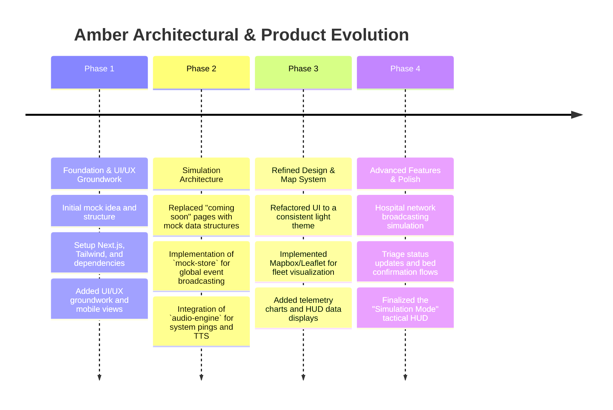
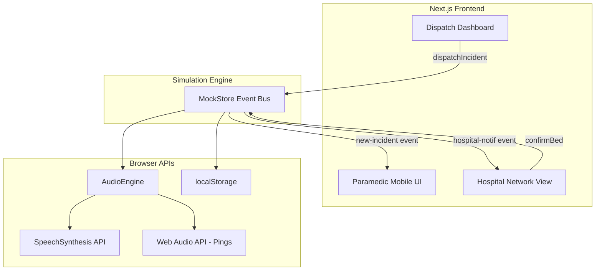

# Amber: Project History, Architectural Evolution & Analysis
**Document Status**: Archival & Onboarding Reference  
**Project North Star**: A next-generation, real-time emergency response dispatch and fleet management system, designed to drastically reduce response latency through predictive triage, automated hospital broadcasting, and a high-performance Dispatch HUD.

---

## 1. Executive Summary & Project Genesis
The `amber` project was conceived as an advanced prototype for a modernized emergency response network. The core problem it addressed was the fragmented communication between dispatchers, paramedics on the field, and receiving hospitals.

Built as a Next.js web application, Amber initially started with basic mockups before evolving into a sophisticated simulation engine. The project features a custom Audio Engine for tactile feedback, a global event bus (`mock-store`) to simulate real-time websocket connections, and a dynamic HUD interface built with Framer Motion, Recharts, and Mapbox GL/Leaflet for fleet tracking. 

This document chronicles the development of the Amber simulation environment, outlining the architectural choices that enable its high-fidelity mock data presentation and real-time event broadcasting.

---

## 2. Chronological Project Timeline

### Phase 1: Foundation & UI/UX Groundwork
* **Initial State**: The project started as a conceptual wireframe.
* **Action Taken**: Initialized a Next.js application. Established the visual language using Tailwind CSS and Lucide icons. Ensured the initial layouts were responsive by focusing heavily on the mobile view, anticipating field use by paramedics.

### Phase 2: Simulation Architecture
* **Initial State**: The application consisted of static "coming soon" placeholders.
* **Action Taken**: To validate the UX without a live backend, the architecture was pivoted towards a high-fidelity simulation. Built the `mock-store.ts` using the native browser `EventTarget` API to create a publish-subscribe event bus. This allowed the "Dispatch" page to fire events that the "Paramedic" and "Hospital" interfaces could listen and react to instantly.

### Phase 3: Refined Design & Map System
* **Initial State**: Data presentation was text-heavy and lacked spatial awareness.
* **Action Taken**: Integrated `mapbox-gl` and `react-leaflet` to provide a real-time geographical view of the emergency fleet. Refined the overall design system, standardizing on a clean light theme. Added `recharts` to display real-time (mocked) patient telemetry data directly on the dispatcher HUD.

### Phase 4: Advanced Features & Polish
* **Initial State**: The system lacked auditory feedback, which is critical in high-stress dispatch environments.
* **Action Taken**: Engineered `audio-engine.ts`, utilizing the Web Audio API for custom system pings and the SpeechSynthesis API to announce incoming emergencies. Finalized the `mock-data-notice` component to clearly demarcate the application's simulation state. 

---

## 3. Deep-Dive: Key Problems & Architectural Solutions

### 3.1 Simulating Real-Time WebSockets
#### The Problem
Building out a full WebSocket backend for a prototype was out of scope, yet the frontend needed to demonstrate instant, real-time communication between Dispatch, Ambulances, and Hospitals to validate the product idea.

#### The Solution
Created `MockStore`, a singleton class extending `EventTarget`.
By utilizing custom browser events (`new-incident`, `hospital-notif`, `bed-confirmed`), the application successfully mimics a WebSocket connection. When Dispatch fires an incident, `MockStore` intercepts it, enriches the data payload (adding telemetry seeds, patient profiles, and triage status), broadcasts it across the application memory space, and persists the active state to `localStorage` so the simulation survives page reloads.

### 3.2 Tactical Auditory Feedback
#### The Problem
A purely visual dashboard is insufficient for a dispatch center where operators are constantly looking away from the screen.

#### The Solution
Developed the `AudioEngine`. Instead of relying on generic browser alert sounds, the engine uses the `AudioContext` API to generate precise, custom sine-wave pings (e.g., 1200Hz for high-priority alerts, 800Hz for network broadcasts). Furthermore, it hooks into the `window.speechSynthesis` API to vocalize dispatch commands ("Emergency protocol initiated. Dispatching unit..."), drastically enhancing the application's realistic, tactical feel.

### 3.3 Spatial Tracking in React
#### The Problem
Integrating complex mapping libraries (Mapbox, Leaflet) into a React environment often leads to rendering bugs and excessive DOM manipulation outside of React's lifecycle.

#### The Solution
Utilized `react-leaflet` to declarative render map components as standard React components. State changes in the `MockStore` (such as an ambulance's coordinates updating) seamlessly trigger React re-renders, causing the map markers to animate to their new locations smoothly without manually interacting with the raw Leaflet DOM API.

---

## 4. Architectural Ledger & Subsystem Design

### 4.1 Mock Data Store (`mock-store.ts`)
* Acts as the central nervous system of the prototype. Handles the `Incident` lifecycle: creation, broadcast to hospitals, triage updates, and bed confirmation. Uses `localStorage` as a makeshift database.

### 4.2 Audio Engine (`audio-engine.ts`)
* Singleton class managing all auditory feedback. Synthesizes tactical pings and manages text-to-speech queues, gracefully falling back if hardware audio is unavailable.

### 4.3 UI Components
* **HUD**: Heavily utilizes Framer Motion for smooth layout transitions as incidents arrive.
* **Telemetry**: Recharts instances that consume the `telemetrySeed` generated by the MockStore to plot simulated heart-rate and oxygen saturation graphs.

---

## 5. Future Regression Prevention Guide

### 1. Browser API Availability
* **Audio Engine Hydration**: The `AudioEngine` relies on `window`. Because Next.js uses Server-Side Rendering (SSR), the engine must gracefully check `typeof window !== 'undefined'` before initializing. Removing these checks will cause fatal 500 errors during the Next.js build process or initial page load.

### 2. Event Listener Cleanup
* **Prevent Memory Leaks**: When React components subscribe to the `MockStore` via `mockStore.addEventListener`, they **must** utilize the `useEffect` cleanup return function to call `mockStore.removeEventListener`. Failure to do so will result in duplicate event firing and severe memory leaks as users navigate between pages.

### 3. Simulation State Stagnation
* **Clear Local Storage**: The `active-incident` is stored in `localStorage`. During development or user testing, if the application appears "stuck" on an old emergency, ensure the UI provides a mechanism to call `mockStore.clearIncident()` to wipe the local cache and reset the event bus.

---
*Amber Architecture & History Ledger · Compiled for Archival · 2026*
