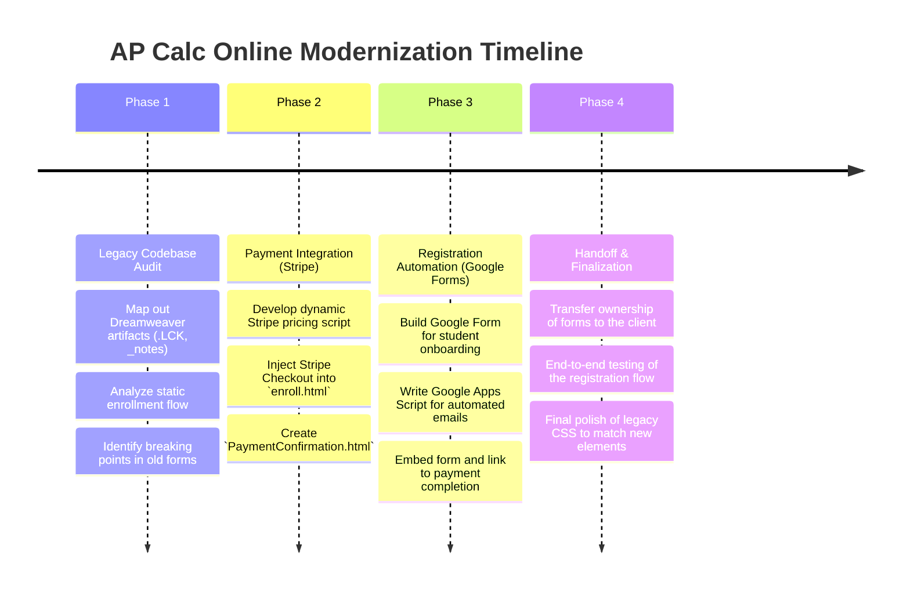
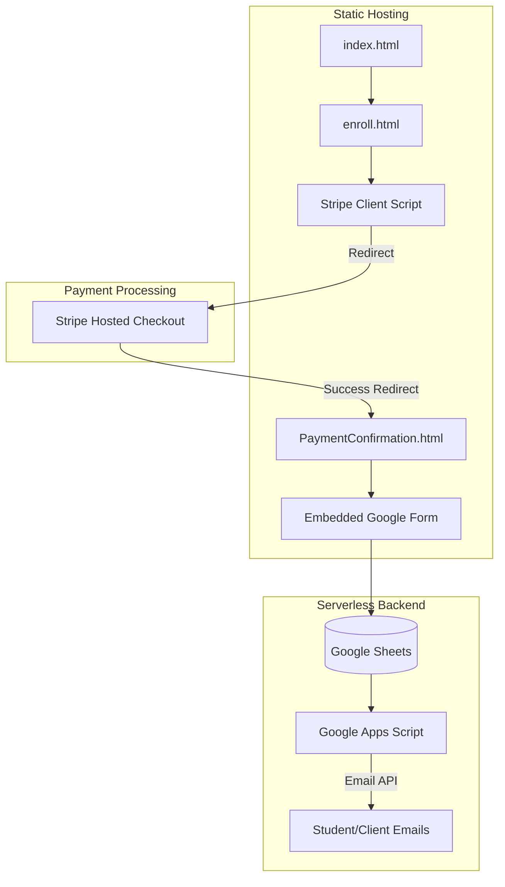

# AP Calc Online: Project History, Architectural Evolution & Analysis
**Document Status**: Archival & Onboarding Reference  
**Project North Star**: A legacy educational platform delivering AP Calculus instruction, modernized with automated Stripe billing and seamless Google Forms integration to streamline student enrollment without abandoning its foundational architecture.

---

## 1. Executive Summary & Project Genesis
`AP Calc Online` began as a traditional web 1.0/2.0 educational site built with Adobe Dreamweaver. The site structure heavily relied on static HTML, `_notes` metadata, embedded `.swf` (Flash) assets, and inline CSS/Scripts. 

As the platform's user base grew, the manual process of handling student registrations and processing payments became a significant bottleneck. The primary objective of the modernization initiative was not to rewrite the entire legacy codebase—which would be cost-prohibitive and unnecessary—but rather to inject modern, reliable payment and registration workflows into the existing `enroll.html` pages.

This document outlines the strategic audit and integration process used to bring a legacy site into the modern e-commerce era via Stripe and Google Apps Script, bridging the gap between old-school static hosting and modern serverless automation.

---

## 2. Chronological Project Timeline

### Phase 1: Legacy Codebase Audit
* **Initial State**: The site consisted of dozens of static HTML pages (`APScores.html`, `StudentReview.html`, etc.) managed via Dreamweaver. The enrollment process was manual and difficult to track.
* **Action Taken**: Audited the `apcalconline` directory. Preserved essential legacy assets like `Home.swf` and `Links.swf` while isolating the target pages for modernization: primarily `enroll.html` and related confirmation pages.

### Phase 2: Payment Integration (Stripe)
* **Initial State**: Payments were handled manually or via outdated gateways.
* **Action Taken**: Implemented a modern Stripe Checkout flow. Created a dynamic Stripe pricing script injected directly into the static `enroll.html` page. This script allowed for secure, off-site payment processing without requiring a backend server for the legacy site.

### Phase 3: Registration Automation (Google Forms)
* **Initial State**: Post-payment, students had to manually email their details, leading to data entry errors and delayed onboarding.
* **Action Taken**: Replaced the static HTML forms with an embedded Google Form. Leveraged **Google Apps Script** to automate the workflow. Upon form submission, the script automatically dispatched personalized confirmation emails to the students and notification alerts to the client.

### Phase 4: Handoff & Finalization
* **Initial State**: The newly integrated systems were hosted under developer accounts.
* **Action Taken**: Executed a seamless handoff. Transferred Google Forms and Google Apps Script ownership to the client. Conducted rigorous end-to-end testing from the `enroll.html` click-through to Stripe, and finally to the `RegistrationConfirmation.html` routing.

---

## 3. Deep-Dive: Key Problems & Architectural Solutions

### 3.1 Injecting Dynamic Logic into a Static Site
#### The Problem
The legacy site was hosted on a basic server without PHP, Node.js, or any backend runtime. Implementing a secure payment gateway typically requires a server to generate secure checkout sessions and handle webhooks.

#### The Solution
Utilized Stripe's client-only checkout integration. By injecting a lightweight JavaScript module into `enroll.html`, the site could redirect users to Stripe's securely hosted checkout pages. We configured Stripe to redirect successful payments back to a newly created `PaymentConfirmation.html` page, effectively closing the loop entirely on the client side.

### 3.2 Bridging Payments and Registration
#### The Problem
We needed to ensure that users only filled out the registration form *after* successful payment, but we had no database to track payment states.

#### The Solution
Created a linear, client-side funnel. 
1. The user selects a course and clicks the Stripe payment button on `enroll.html`.
2. Stripe processes the payment and redirects to `PaymentConfirmation.html`.
3. `PaymentConfirmation.html` immediately embeds or redirects to the Google Form for student details.
4. The Google Apps Script acts as the lightweight "backend," firing off emails and logging the student into a Google Sheet.

### 3.3 Preserving the Legacy Aesthetic
#### The Problem
Modern embeddable forms and Stripe buttons often clash with the styling of sites built in the late 2000s/early 2010s, causing jarring user experiences.

#### The Solution
Carefully wrapped the Stripe integration and Google Form iframes in `div` containers styled with the legacy site's existing CSS classes (found in the `CSS` and `_cssstyles` directories). This ensured that while the technology was modern, it seamlessly blended with the historical look and feel of `AP Calc Online`.

---

## 4. Architectural Ledger & Subsystem Design

### 4.1 Frontend Modifications
* `enroll.html`: The core funnel entry point. Modified to include dynamic pricing logic and Stripe buttons.
* `PaymentConfirmation.html` / `RegistrationConfirmation.html`: New static pages acting as the glue between Stripe and Google Forms.

### 4.2 Serverless Architecture (Google Apps Script)
* Acts as the invisible backend. Listens for `onFormSubmit` triggers. Parses the form payload and uses `MailApp` or `GmailApp` to send automated, templated emails to the registered student and the site administrator.

---

## 5. Future Regression Prevention Guide

### 1. Modifying the Payment Flow
* **Do not alter the Stripe success redirect URL** in the Stripe dashboard without simultaneously updating the site routing. The connection between Stripe and the Google Form relies entirely on this redirect mechanism.

### 2. Dreamweaver Artifacts
* **Ignore `.LCK` and `_notes` files**. These are legacy Dreamweaver locking and synchronization files. They do not affect the live site but should not be deleted as they may cause errors if the client still opens the site in an older version of Dreamweaver.

### 3. Google Apps Script Maintenance
* If the client changes their primary email address, the Google Apps Script attached to the registration Google Sheet must be updated. Re-authorize the script after any account changes to ensure automated emails continue to send.

---
*AP Calc Online Architecture & History Ledger · Compiled for Archival · 2026*
