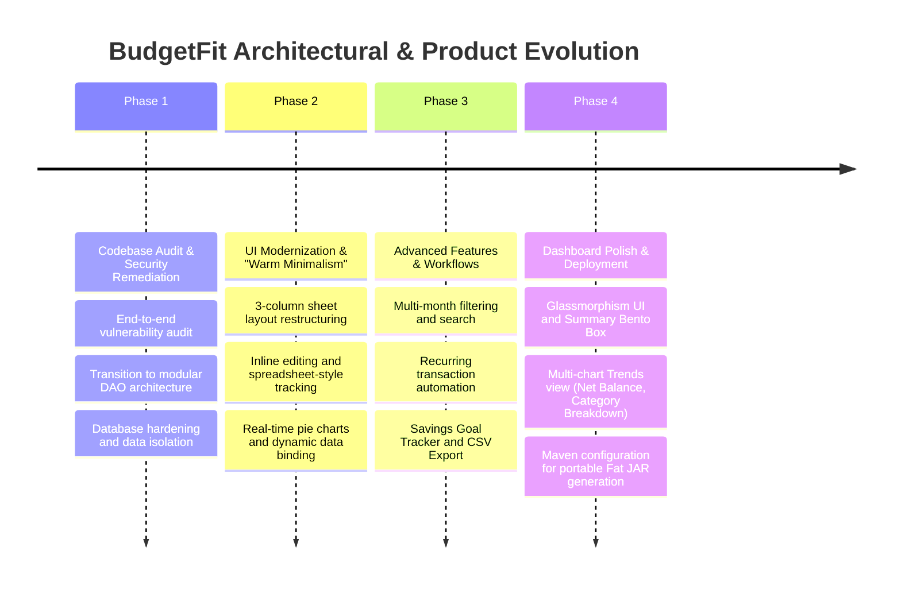
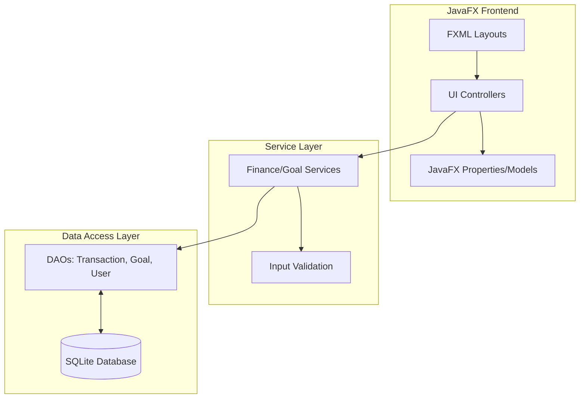

# BudgetFit: Project History, Architectural Evolution & Analysis
**Document Status**: Archival & Onboarding Reference  
**Project North Star**: A modern, secure, and visually appealing JavaFX desktop application for personal finance tracking, featuring "Warm Minimalism" design, real-time analytics, and secure data handling.

---

## 1. Executive Summary & Project Genesis
BudgetFit began as a Java-based desktop budgeting tool. The goal was to provide users with a robust, offline-first financial tracker that combined the analytical power of a spreadsheet with the aesthetics of a modern web application.

Early versions of BudgetFit relied on monolithic UI controllers and direct database access, which led to fragile layouts, FXML loading errors, and security vulnerabilities. Over a series of intensive sprints, the project underwent a comprehensive audit and modernization initiative. This included refactoring the backend into a modular DAO-based architecture, resolving critical security gaps, and completely overhauling the frontend to adopt a "Warm Minimalism" aesthetic with advanced glassmorphism components.

This document serves as the historical ledger detailing the architectural pivots, security remediations, and design evolution of BudgetFit.

---

## 2. Chronological Project Timeline

### Phase 1: Codebase Audit & Security Remediation
* **Initial State**: The application suffered from architectural weaknesses, including monolithic controllers handling both UI logic and database operations. There were potential vulnerabilities regarding data integrity and security controls.
* **Action Taken**: Conducted a rigorous end-to-end audit. Transitioned the application to a modular Data Access Object (DAO) architecture, completely decoupling the UI from the database. This ensured secure data isolation and allowed for unit testing of core business logic.

### Phase 2: UI Modernization & "Warm Minimalism"
* **Initial State**: The UI was functional but lacked modern design sensibilities. FXML loading errors frequently disrupted the user experience, and data visualization was static.
* **Action Taken**: Completely restructured the dashboard into a highly usable, three-column sheet layout. Implemented "Warm Minimalism" aesthetics. Optimized row-based inputs to provide a seamless "spreadsheet-style" tracking experience. Integrated real-time reactivity across all financial tables, ensuring that pie charts dynamically updated based on user-editable monthly income values.

### Phase 3: Advanced Features & Workflows
* **Initial State**: BudgetFit lacked tools for long-term financial planning and repetitive task automation.
* **Action Taken**: Developed a new database schema to support recurring transaction workflows with automated synchronization logic. Introduced advanced financial insights through a dedicated Savings Goal Tracker. Added essential productivity features like multi-month filtering, search functionality, and CSV export capabilities. Implemented dark mode for a production-ready feel.

### Phase 4: Dashboard Polish & Deployment
* **Initial State**: The dashboard lacked real-time, aggregated metrics, and the application was difficult to distribute to end-users.
* **Action Taken**: Finalized the Glassmorphism UI aesthetic by integrating a Summary Bento Box for real-time financial metrics. Expanded analytical capabilities by building a multi-chart Trends view (Net Balance and Category Breakdown). Added non-blocking notification toasts and streamlined "Quick Contribution" workflows. Finally, configured Maven to generate a portable Fat JAR, hardening the application for deployment.

---

## 3. Deep-Dive: Key Problems & Architectural Solutions

### 3.1 The FXML Controller Monolith
#### The Problem
Initial JavaFX controllers were overloaded, handling FXML injection, event handling, business logic, and raw SQL queries simultaneously. This caused frequent `FXMLLoader` exceptions, made the UI sluggish during database reads, and rendered unit testing nearly impossible.

#### The Solution
Adopted a strict DAO (Data Access Object) and Service Layer pattern.
1. **DAO Layer**: Abstracted all SQL operations into dedicated classes (e.g., `TransactionDAO`, `GoalDAO`).
2. **Service Layer**: Introduced services to handle business logic and data validation before interacting with the DAOs.
3. **Controller Refactoring**: Controllers were stripped down to exclusively handle UI updates and user input, delegating all data operations to the Service Layer via asynchronous tasks to prevent blocking the JavaFX Application Thread.

### 3.2 Real-time UI Reactivity in JavaFX
#### The Problem
Updating the dashboard pie charts and summary metrics required manual refresh triggers after every transaction edit or addition, leading to a disjointed user experience.

#### The Solution
Leveraged JavaFX `Property` bindings and `ObservableList`.
* **Data Models**: Updated model classes (`Transaction`, `Goal`) to use `SimpleStringProperty`, `SimpleDoubleProperty`, etc.
* **Bindings**: Bound UI components (like the Total Balance label and PieChart data slices) directly to aggregate properties in the Service Layer. When the `ObservableList` of transactions changes, listeners automatically trigger UI updates, creating a seamless, reactive "spreadsheet-style" experience.

### 3.3 Portable Deployment
#### The Problem
Distributing a JavaFX application with external database dependencies (e.g., SQLite) often led to classpath errors and missing native libraries on end-user machines.

#### The Solution
Restructured the `pom.xml` to utilize the Maven Shade Plugin to bundle all dependencies, including the SQLite JDBC driver, into a single, executable Fat JAR. Configured the database connection string to create the SQLite file in the user's home directory (`~/.budgetfit/data.db`) rather than the relative project path, ensuring persistence across updates and environments.

---

## 4. Architectural Ledger & Subsystem Design

### 4.1 Frontend (JavaFX)
* **Views**: FXML-based layouts styled with custom CSS (`index.css`) to achieve the Glassmorphism and Warm Minimalism aesthetics.
* **Controllers**: Lean controllers responsible for view initialization and binding (`DashboardController`, `TrendController`).
* **Components**: Custom Bento Box summaries, multi-series Line/Bar charts, and responsive tables.

### 4.2 Backend (Java Services)
* **Services**: Encapsulate core business logic, such as calculating net variance, amortizing recurring transactions, and generating trend data structures.
* **Security**: Handles data sanitization and confirmation workflows before permanent deletion operations.

### 4.3 Database (SQLite)
* **Schema**: Relational tables for Users, Transactions, Categories, and Goals. 
* **Persistence**: Local SQLite database ensuring offline functionality and rapid read/write access.

---

## 5. Future Regression Prevention Guide

To maintain BudgetFit's stability:

### 1. JavaFX Threading Rules
* **NEVER perform database operations on the JavaFX Application Thread**. All DAO and Service calls must be executed asynchronously using `Task<T>` or `CompletableFuture`. Updates to the UI post-execution must be wrapped in `Platform.runLater()`.

### 2. Model Property Bindings
* **Always use JavaFX Properties** (`DoubleProperty`, `StringProperty`) in model classes instead of primitive types. This guarantees that UI bindings remain reactive and prevents manual refresh bugs.

### 3. FXML Loading
* Ensure all `@FXML` injected fields perfectly match the `fx:id` in the corresponding `.fxml` file. Mismatches will cause silent null pointers during runtime.
* Keep controllers decoupled from specific FXML hierarchies where possible to allow layout restructuring without breaking logic.

---
*BudgetFit Architecture & History Ledger · Compiled for Archival · 2026*
