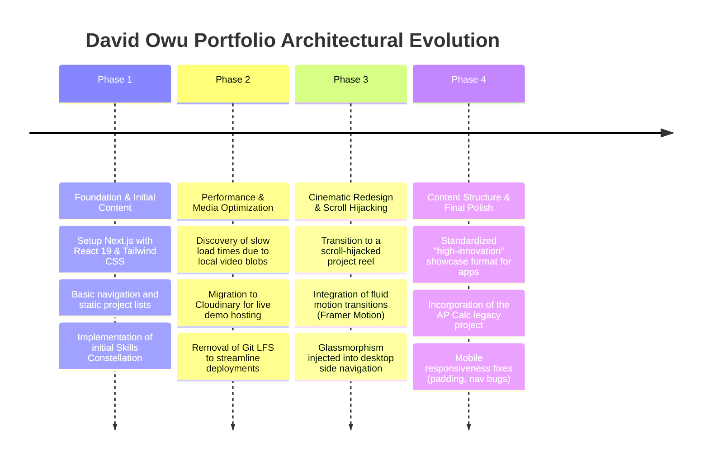
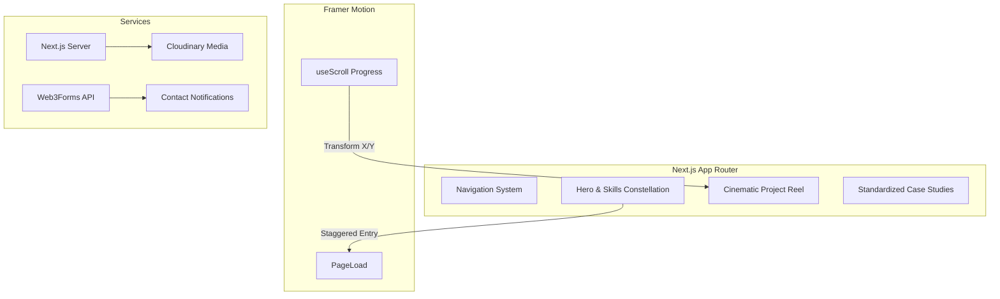

# David Owu (Portfolio): Project History, Architectural Evolution & Analysis
**Document Status**: Archival & Onboarding Reference  
**Project North Star**: A high-fidelity, highly interactive personal portfolio designed to wow recruiters and clients. Built with Next.js and Framer Motion to deliver a "Cinematic Scroll-Reel" experience that visualizes technical complexity without sacrificing clean, minimalist UI.

---

## 1. Executive Summary & Project Genesis
The `davidowu` project is a personal portfolio application that evolved from a standard, static Next.js template into a highly optimized, interactive showcase. 

Initially, the portfolio suffered from performance issues due to heavy, locally stored video blobs and a disjointed navigation system. To stand out to recruiters, a major redesign initiative was launched ("Architecting Cinematic Portfolio Showcases"). This involved transitioning to a scroll-hijacked cinematic project reel, migrating media assets to external CDNs (Cloudinary), and developing a standardized, mind-map blueprint to present complex applications (like BudgetFit and Koji).

This document outlines the optimization efforts and architectural pivots that transformed the portfolio into a performant, visually stunning web experience.

---

## 2. Chronological Project Timeline

### Phase 1: Foundation & Initial Content
* **Initial State**: The portfolio was a standard Next.js application using Tailwind CSS. It included basic routing and a static list of projects. The "Skills Constellation" was introduced as a visual flair but lacked mobile optimization.
* **Action Taken**: Established the baseline routing and content structure. Tweaked the initial Framer Motion animations to provide a smoother entry experience.

### Phase 2: Performance & Media Optimization
* **Initial State**: Attempting to host high-quality video demonstrations locally caused severe repository bloat and slow First Contentful Paint (FCP) metrics. The repository flirted with Git LFS (Large File Storage) but found it cumbersome for the CI/CD pipeline.
* **Action Taken**: Removed Git LFS entirely. Migrated all heavy video assets and project previews to Cloudinary. This drastically reduced the repository size, improved performance, and ensured live demo reliability. 

### Phase 3: Cinematic Redesign & Scroll Hijacking
* **Initial State**: Project lists were standard vertical scrolls, which felt generic and unengaging. The navigation felt disjointed between desktop and mobile views.
* **Action Taken**: Executed a UI redesign strategy to create a "Cinematic Portfolio Showcase."
  * **Scroll-Reel**: Implemented a scroll-hijacked cinematic reel for projects, utilizing Framer Motion to bind the scroll position to element scale and opacity.
  * **Navigation**: Added a glassmorphism effect to the side navigation on desktop, and fixed persistent padding bugs in the mobile nav.

### Phase 4: Content Structure & Final Polish
* **Initial State**: Project case studies were inconsistent. Some had too much text, others lacked technical depth.
* **Action Taken**: Developed a standardized, mind-map blueprint format for app-based projects (like Koji and BudgetFit) to visually convey technical complexity. Added the legacy "AP Calc" project to demonstrate range. Optimized the mobile view for the "Sneak Peek" and "Skills Constellation" components to ensure a premium feel on all devices.

---

## 3. Deep-Dive: Key Problems & Architectural Solutions

### 3.1 Media Hosting & Repository Bloat
#### The Problem
Directly importing high-resolution `.mp4` and `.webm` files into the Next.js `public` directory inflated the build size. Vercel/Render deployments were stalling, and the user experience was severely degraded on mobile networks.

#### The Solution
Moved entirely away from local blobs. Adopted Cloudinary as the definitive media CDN. Updated the Next.js `next.config.js` to whitelist Cloudinary domains, allowing the `next/image` and `next/video` components to automatically optimize formats and serve next-gen formats (WebP/AVIF) based on the user's browser.

### 3.2 The "Cinematic Scroll" Implementation
#### The Problem
Standard CSS `overflow-y: scroll` does not provide the "wow" factor required to capture a recruiter's attention in a competitive market.

#### The Solution
Leveraged `framer-motion`'s `useScroll` and `useTransform` hooks. 
By tracking the `scrollYProgress` of the main container, the portfolio maps the scroll percentage to the `x` axis of the project reel (creating a horizontal scroll effect from a vertical scroll action) and applies dynamic `scale` and `opacity` to the project cards as they enter the viewport.

### 3.3 Mobile Navigation Disconnect
#### The Problem
The glassmorphism side navigation worked beautifully on desktop but obscured content on mobile screens, leading to padding bugs and unclickable areas.

#### The Solution
Implemented a strict responsive breakpoint strategy. The side navigation completely unmounts on mobile (`hidden md:flex`), replaced by a sticky bottom or top bar utilizing the same glassmorphism CSS backdrop filters (`backdrop-blur-md bg-white/10`).

---

## 4. Architectural Ledger & Subsystem Design

### 4.1 Technologies Used
* **Framework**: Next.js (React 19)
* **Styling**: Tailwind CSS (v4)
* **Animation**: Framer Motion
* **Forms**: `@web3forms/react` for serverless contact form submissions.

---

## 5. Future Regression Prevention Guide

### 1. Media Asset Management
* **Never commit video files to the repository**. All new project demonstrations must be uploaded to Cloudinary, and the resulting URL should be referenced in the project data JSON. Committing large blobs will break the deployment pipeline.

### 2. Framer Motion Scroll Hook Caution
* When modifying the Cinematic Reel, ensure that the `ref` passed to `useScroll` correctly targets the outermost bounding container. If the layout shifts (e.g., due to dynamic content loading above the reel), the scroll offsets will misalign, causing animations to trigger too early or too late.

### 3. Form Submission API
* The contact form relies on `Web3Forms`. Ensure the public access key remains valid and is securely stored in environment variables, though it is safe for client-side exposure.

---
*David Owu Portfolio Architecture & History Ledger · Compiled for Archival · 2026*
