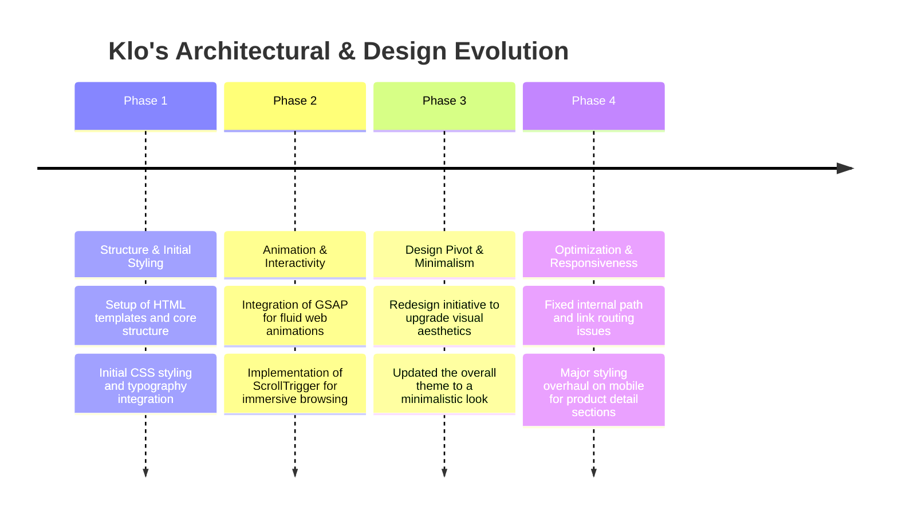
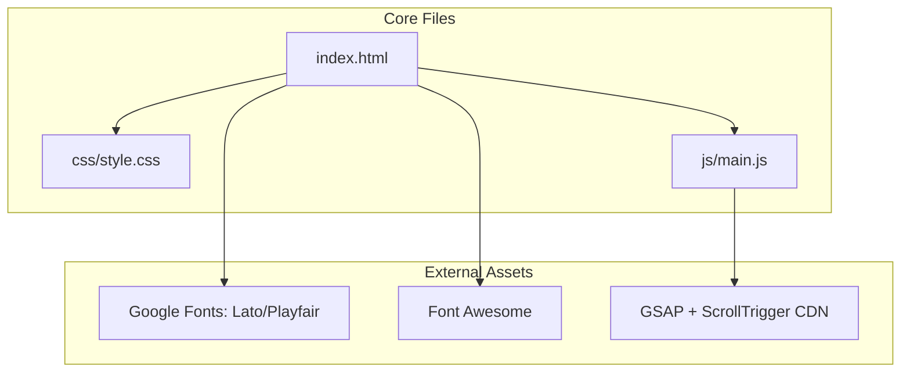

# Klo's House of Fashion: Project History, Architectural Evolution & Analysis
**Document Status**: Archival & Onboarding Reference  
**Project North Star**: A premium, visually engaging e-commerce storefront landing page for a fashion brand, emphasizing fluid animations and a minimalistic design aesthetic to showcase high-end products.

---

## 1. Executive Summary & Project Genesis
The `KLO'S` project is a static frontend web application serving as the primary digital storefront for "Klo's House of Fashion." Built with pure HTML, CSS, and vanilla JavaScript, the project focuses entirely on delivering a high-performance, visually striking user experience without the overhead of heavy JavaScript frameworks.

The development journey centered around refining the UI/UX, transitioning from an initially dense layout to a modern, minimalistic look. Key technical milestones involved the integration of GSAP (GreenSock Animation Platform) for scroll-triggered animations and resolving deep mobile responsiveness issues within the product detail sections.

This document serves as the historical ledger detailing the design iterations and frontend optimizations of the Klo's storefront.

---

## 2. Chronological Project Timeline

### Phase 1: Structure & Initial Styling
* **Initial State**: The project started as standard HTML mockups with basic CSS.
* **Action Taken**: Established a modular folder structure (`css`, `js`, `images`, `html templates`). Integrated premium typography (Lato, Playfair Display) via Google Fonts to immediately elevate the brand's visual identity.

### Phase 2: Animation & Interactivity
* **Initial State**: The page was static, which felt unengaging for a premium fashion brand.
* **Action Taken**: Brought the interface to life by integrating GSAP and ScrollTrigger. This allowed elements (like hero images and product carousels) to fade in and translate smoothly as the user scrolled down the page, creating a "magazine-like" browsing experience.

### Phase 3: Design Pivot & Minimalism
* **Initial State**: The initial design iterations were functional but lacked the "high-end" feel expected of a fashion house.
* **Action Taken**: Executed a comprehensive design upgrade ("updated to minimalistic look"). Stripped away unnecessary borders, increased whitespace, and relied heavily on typography and high-quality imagery to guide the user's eye.

### Phase 4: Optimization & Responsiveness
* **Initial State**: The site suffered from broken relative links and poor mobile rendering, specifically in the complex product detail sections.
* **Action Taken**: Conducted a bug-fixing sprint to resolve broken paths across the HTML templates. Completely refactored the CSS media queries to ensure the product details section stacked elegantly on mobile devices without horizontally overflowing.

---

## 3. Deep-Dive: Key Problems & Architectural Solutions

### 3.1 High-Performance Animations without Frameworks
#### The Problem
Implementing complex scroll-linked animations in pure CSS and vanilla JS can lead to "jank" and poor frame rates on mobile devices due to main thread blocking.

#### The Solution
Adopted GSAP (GreenSock). By utilizing GSAP's optimized rendering engine, animations were offloaded to the GPU where possible, ensuring smooth 60fps transitions even on lower-end mobile devices without needing to migrate the entire project to a framework like React or Vue.

### 3.2 Mobile-First Product Details
#### The Problem
Fashion product sections typically contain multiple images, size selectors, and accordion descriptions. Fitting this into a standard mobile viewport caused layout breaking and text overlapping.

#### The Solution
Utilized CSS Flexbox and Grid. The product details section was rewritten to use a single-column layout on screens smaller than `768px`, with a sticky "Add to Cart" button at the bottom of the viewport to maintain high conversion rates despite the vertical scrolling required to read descriptions.

---

## 4. Architectural Ledger & Subsystem Design

### 4.1 Technology Stack
* **Markup/Styling**: HTML5, Vanilla CSS3 (Custom properties for theming).
* **Interactivity**: Vanilla JavaScript.
* **Animation**: GSAP via CDN to avoid `npm` build step overhead.

---

## 5. Future Regression Prevention Guide

### 1. External CDN Dependencies
* **Monitor CDN Uptime**: The site's core animations and icons rely on external CDNs (FontAwesome, GSAP). If the site appears completely unstyled or static, the first debugging step should be checking network blocks or CDN failures in the browser console.

### 2. Relative Pathing
* **Maintain Folder Structure**: Because the project uses raw HTML templates instead of a bundler/router, moving files out of the `html templates` folder will break relative image and CSS paths. Always ensure `../css/style.css` relationships are preserved if modifying the directory tree.

---
*Klo's House of Fashion Architecture Ledger · Compiled for Archival · 2026*
