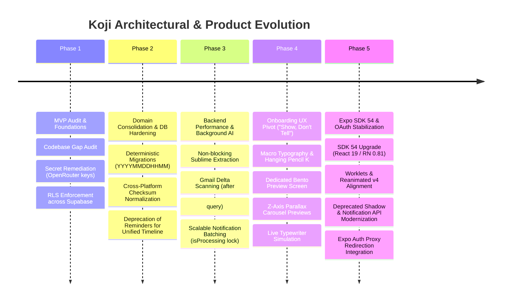
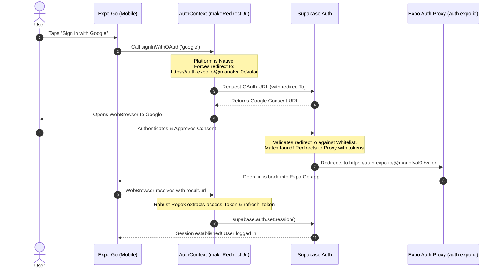
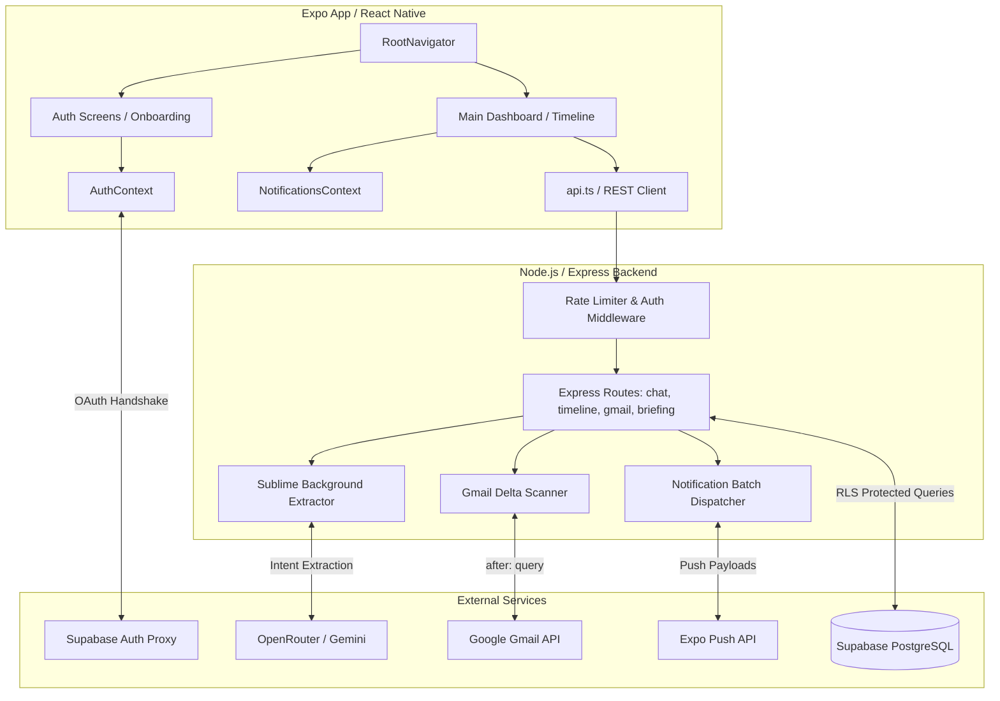

# Koji: Project History, Architectural Evolution & Analysis
**Document Status**: Archival & Onboarding Reference  
**Project North Star**: A mobile-first, chat-first execution layer and AI Manager for student developers balancing university coursework, self-learning, freelancing, and job applications.

---

## 1. Executive Summary & Project Genesis
Koji began as an "AI Chief of Staff" (later refined to "AI Manager" to emphasize active assistance in balancing learning and work) designed specifically for student developers juggling competing life tracks. The foundational premise relied on a core loop: **Chat → Intent Extraction → Timeline/Progress Update → Daily Brief Synthesis**. 

Early iterations of the MVP proved functionally viable but suffered from architectural fragility, high latency, unoptimized LLM calls, and unreliable authentication flows in mobile development environments. Over a multi-month intensive hardening and modernization initiative, Koji underwent significant transformations across its backend infrastructure, database architecture, onboarding user experience, and mobile runtime environment (Expo SDK 54).

This document serves as the authoritative timeline, architectural ledger, and regression-prevention guide detailing every challenge, pivot, redesign, and technical decision made during Koji's journey to a production-ready Beta.

---

## 2. Chronological Project Timeline



### Phase 1: MVP Audit & Security Foundations
* **Initial State**: The MVP had functional chat and basic timeline insertion but lacked fundamental security boundaries. Hardcoded OpenRouter API keys existed within server extraction routes, and Supabase tables lacked Row-Level Security (RLS).
* **Action Taken**: Conducted a peer-review style audit (`koji-gap-audit`). Extracted all secrets into environment variables with startup-time validation (`check-env.js`, `scan-secrets.js`). Enforced strict RLS policies on `profiles`, `briefings`, `timeline_entries`, `gmail_scan_results`, and `user_usage` to guarantee data isolation per user.
* **Rate Limiting**: Implemented robust rate-limiting middleware distinguishing authenticated users (20 RPM) from anonymous users (5 RPM) to protect LLM API budgets.

### Phase 2: Database & Domain Consolidation
* **Initial State**: Ad-hoc, conflicting numeric migration prefixes (e.g., `003/004`) caused non-deterministic deployment orders. Furthermore, time-sensitive tasks were split between a legacy `reminders` table and `timeline_entries`, causing dual maintenance overhead.
* **Action Taken**: Established a canonical, deterministic migration standard (`YYYYMMDDHHMM__description.sql`) tracked via an idempotent `koji_schema_migrations` ledger. 
* **Platform Checksum Crisis**: Discovered that Windows development (CRLF line endings) and Render Linux deployment (LF line endings) caused false SHA-256 checksum mismatches, halting deployments. Solved by normalizing `\r\n` to `\n` prior to hashing in `run_ordered_migrations.js` and `fix_checksums.js`.
* **Domain Merge**: Completely deprecated `RemindersScreen` and `ReminderItem`, migrating all scheduled tasks into `timeline_entries` as the single source of truth.

### Phase 3: Backend Performance & Background Intelligence (Sublime & Gmail)
* **Initial State**: Chat responses were severely delayed due to synchronous, blocking database writes during AI intent extraction. Gmail scanning processed entire mailboxes redundantly, incurring massive LLM token costs. `processDueNotifications` queried every uncompleted task in the database on every polling interval.
* **Action Taken**: 
  * **Sublime System**: Offloaded intent extraction to non-blocking background promises (`sublime.js`). Optimized extraction by passing existing profile/course context directly from chat routes to prevent redundant database lookups. Added deduplication logic to ensure repeated chat mentions didn't spawn duplicate timeline entries.
  * **Gmail Delta Scanning**: Introduced `gmail_last_scanned_at` in the `profiles` table. Modified the Gmail fetcher to use `after:` queries, ensuring only newly arrived threads are processed. Scanned results are now persisted to `gmail_scan_results` and fed directly into the morning Daily Briefing synthesis.
  * **Notification Scalability**: Optimized polling queries with `.limit(500)` batching and an in-memory `isProcessing` mutex lock to prevent concurrent dispatch collisions.

### Phase 4: Onboarding UX Redesign ("Show, Don't Tell" & Edge-to-Edge Parallax)
* **Initial State**: Onboarding relied on generic, abstract line illustrations confined to safe 50% top-half bounding boxes, making the application feel basic and constrained.
* **Action Taken**: Executed a massive visual overhaul designed to wow users and showcase real application value ("balance learning & work").
  * **Welcome Screen**: Stripped clutter in favor of dominant macro-typography (`fontSize: 42`) and a signature "Pencil K" watermark hanging off the top-right corner.
  * **Bento Preview Screen**: Created a dedicated interstitial screen (`BentoPreviewScreen.tsx`). Initially experimented with an oversized 1.3x diagonal panning grid, but pivoted to a highly functional 3-page horizontal swipeable feature showcase (Timeline Day View, CGPA Tracker displaying `3.68 / 5.00` with a `4.50` target, and Smart Gmail Nudges) to guarantee 100% legibility without bleeding off-screen.
  * **Intro Carousel**: Replaced static vertical stacks with a Z-axis depth composition. Implemented concrete Before/After transformations (PDF timetable → clean timeline, scattered grades → CGPA projection arc, cluttered inbox → smart Koji nudges). Reigned in container swell and centered offsets to keep cards completely visible.
  * **Live Typing Simulation**: Replaced static intro text with `TypingSimulation.tsx`, an animated typewriter chat bubble simulating Koji introducing itself character-by-character with a blinking cursor and typing badge.

### Phase 5: Expo SDK 54 Migration & OAuth Redirection Stabilization
* **Initial State**: Upgrading to Expo SDK 54 (React 19, React Native 0.81.x) broke legacy native modules, caused notification runtime crashes, and triggered web styling deprecation warnings. Most critically, Supabase OAuth authentication failed inside the Expo Go mobile app, falling back to `http://localhost:3000` with `bad_oauth_state` errors due to dynamic IP mismatches.
* **Action Taken**:
  * **Dependency Alignment**: Locked `react-native-worklets` to `0.5.1` to maintain compatibility with Reanimated v4.
  * **API Modernization**: Updated `NotificationsContext.tsx` to replace the deprecated `removeNotificationSubscription` with the modern `sub.remove()` pattern. Replaced legacy `shadow*` style props with CSS `boxShadow` across auth screens to satisfy React Native Web / React 19 standards.
  * **OAuth Redirection Saga**: Resolved mobile redirect failures by shifting away from fragile dynamic IPs (`exp://192.168...`) and custom `koji://` schemes. Implemented the managed **Expo Auth Proxy** (`https://auth.expo.io/@manofval0r/valor`) for native platforms in `AuthContext.tsx`. This provided a permanent, professional redirect URI whitelisted in Supabase, ensuring flawless Google/GitHub authentication handoffs inside the Expo Go store app. Fixed scoping `styles` and `Platform` reference errors in auth screens.

---

## 3. Deep-Dive: Key Problems & Architectural Solutions

### 3.1 The OAuth Redirection & `bad_oauth_state` Crisis


#### The Problem
When testing in the Expo Go mobile app, Supabase consistently rejected the OAuth redirect, sending users to `http://localhost:3000/?error=invalid_request&error_code=bad_oauth_state`. This occurred because Expo Go dynamically generates deep link URLs based on local IP addresses (e.g., `exp://192.168.1.5:8081`). Because Supabase requires strict, exact string matching in its Redirect URL Allow List, dynamic IPs naturally fail, causing Supabase to fall back to the default site URL (`localhost:3000`). This fallback loses the OAuth state verification parameter, triggering the crash.

#### The Solution
We abandoned local IP matching and custom scheme workarounds (`koji://`) for mobile runners, standardizing on the **Expo Auth Proxy**.
1. **Dashboard Configuration**: Whitelisted `https://auth.expo.io/@manofval0r/valor` as the primary mobile redirect URI in Supabase.
2. **Context Hardening**: Updated `AuthContext.tsx` to dynamically route web users to standard `makeRedirectUri()` while forcing native mobile users to the stable Expo Auth Proxy URL.
3. **Robust Token Extraction**: Implemented custom regex parsing in `AuthContext.tsx` to reliably capture `access_token` and `refresh_token` from both URL fragments (`#`) and query strings (`?`), ensuring robust session recovery regardless of browser formatting.

### 3.2 Cross-Platform Migration Checksum Mismatches
#### The Problem
The automated deployment pipeline on Render consistently failed with `Checksum mismatch for applied migration...`. The development environment was Windows-based, which automatically appended Carriage Return Line Feed (`\r\n`) endings to SQL files. When Render cloned the repository on Linux, `git checkout` converted files to Line Feed (`\n`). Because the migration runner's `sha256()` function hashed raw file buffers, the exact same SQL statements produced entirely different hashes between Windows and Linux.

#### The Solution
Modified the hashing algorithm in `run_ordered_migrations.js` and `fix_checksums.js` to be line-ending agnostic:
```javascript
function sha256(value) {
  // Normalize line endings (CRLF → LF) to prevent cross-platform checksum mismatches
  const normalized = value.replace(/\r\n/g, '\n');
  return crypto.createHash('sha256').update(normalized, 'utf8').digest('hex');
}
```
This simple normalization completely eliminated false deployment failures while preserving strict cryptographic verification of schema integrity.

### 3.3 The Onboarding Redesign Pivot: Bleeding Edges vs. Functional Legibility
#### The Problem
During the UI modernization phase, an attempt was made to create an "edge-to-edge" immersive experience by rotating the Bento grid `-6deg` and scaling it to `1.3x` screen width. While visually striking, this caused critical text and mock UI elements (such as deadline titles and progress metrics) to bleed off the physical screen boundaries, rendering the core "Show, Don't Tell" value proposition unreadable. Similarly, absolute positioning in the Intro Carousel caused cards to stack directly on top of one another.

#### The Solution
We executed a disciplined pivot balancing premium aesthetics with functional clarity:
* **Bento Preview**: Replaced the panning oversized grid with a horizontal `ScrollView` (`pagingEnabled`) containing 3 distinct Feature Spotlights. Each spotlight presents a 100% visible, beautifully framed mock card (Timeline, CGPA Tracker, Smart Nudges) allowing users to swipe at their own pace.
* **Carousel Overlap**: Replaced absolute positioning with a vertical `flexbox` column (`gap: 16`), utilizing transforms solely for subtle tilt (`rotate: -4deg` vs `1.5deg`) and horizontal stagger (`translateX`). This achieved the desired 3D depth illusion while guaranteeing cards never clip or collide.

---

## 4. Architectural Ledger & Subsystem Design



### 4.1 Frontend (Koji App)
* **State & Navigation**: Built on React Navigation v6/v7 (`RootNavigator.tsx`). Uses a segmented flow protecting main routes behind `AuthContext`.
* **Styling**: Vanilla React Native `StyleSheet` utilizing centralized tokens (`theme.ts`). Adheres to a strict "Notebook" design aesthetic (ruled lines, left margin rules, JetBrains Mono / Raleway typography). Modernized to use `boxShadow` over deprecated `shadow*` props for React 19 / Web compatibility.
* **Network Layer**: Centralized in `api.ts`. Configured with dynamic environment switching (`LOCAL_HOST` vs `PRODUCTION_URL`), 90-second timeouts to mitigate Render server cold starts, and custom chunked error parsing for streaming SSE endpoints.

### 4.2 Backend (Express / Node.js)
* **Middleware**: Enforces Supabase JWT verification on protected routes. Implements dual-tier rate limiting (`rateLimit.js`) backed by PostgreSQL tracking (`user_usage`).
* **Sublime Extractor (`sublime.js`)**: Asynchronous execution engine. Receives chat payloads, fetches conversational history, invokes OpenRouter/Gemini for structured JSON intent parsing, and executes idempotent writes to `timeline_entries`, `courses`, and `assessments`.
* **Gmail Scanner (`gmail.js`)**: Connects via user-delegated OAuth refresh tokens. Utilizes `gmail_last_scanned_at` timestamps to perform lightweight delta queries (`in:inbox -category:promotions after:{timestamp}`). Extracts actionable student deadlines and logs them to `gmail_scan_results`.
* **Notification Engine (`notifications.js`)**: Cron-driven daemon. Polls `timeline_entries` for upcoming deadlines, calculates dynamic threshold alerts (1w, 1d, 3h) and ghost deadline nudges, and dispatches batched payloads to the Expo Push API. Protected against concurrent race conditions via an `isProcessing` memory lock.

### 4.3 Database Schema & RLS Security
All tables reside in Supabase PostgreSQL, strictly gated by Row-Level Security matching `auth.uid() = user_id`.
* `profiles`: Stores core user preferences, FCM/Expo push tokens, Gmail refresh tokens (encrypted), and `gmail_last_scanned_at` cursors.
* `timeline_entries`: The master ledger for all scheduled tasks, exams, reminders, and deadlines. Replaced the legacy reminders table.
* `gmail_scan_results`: Interstitial storage for detected email deadlines pending user confirmation or morning briefing inclusion.
* `user_usage`: Tracks daily token consumption and message counts for rate limiting.
* `koji_schema_migrations`: Tracks applied database migrations and normalized SHA-256 checksums.

---

## 5. Future Regression Prevention Guide

To maintain Koji's current stability and prevent the recurrence of historical bugs, all future contributors must strictly adhere to the following guardrails:

### 1. Authentication & Redirection Guardrails
* **NEVER change mobile OAuth redirect strings to local IPs or ad-hoc schemes**. Native mobile authentication relies entirely on the Expo Auth Proxy (`https://auth.expo.io/@manofval0r/valor`). Modifying this string will immediately break login for Expo Go users.
* **Preserve Token Extraction Regex**: Supabase and Expo Auth Session frequently alter whether tokens return in URL fragments (`#`) or query parameters (`?`). The dual-extraction regex in `AuthContext.tsx` must remain intact to ensure seamless session recovery across all devices and browsers.

### 2. Database Migration Guardrails
* **NEVER modify an already-applied SQL migration file**. Editing an existing migration alters its SHA-256 checksum, causing the deployment runner (`run_ordered_migrations.js`) to throw a fatal error and halt backend deployment.
* **Always use the Checksum Fixer if line endings drift**: If git configuration changes cause CRLF/LF discrepancies that bypass normalization, execute `node scratch/fix_checksums.js` locally to resynchronize database hashes prior to committing.

### 3. Mobile Runtime & Expo SDK Guardrails
* **Lock Native Module Versions**: Koji operates on Expo SDK 54 (React 19, React Native 0.81.x). Peer dependencies such as `react-native-worklets` must remain locked to their compatible sub-versions (e.g., `0.5.1` for Reanimated v4). Blindly running `npm update` or installing unverified packages will cause immediate C++ HostFunction exceptions on mobile.
* **Maintain Modern API Standards**: Do not reintroduce deprecated React Native APIs. Push notification listeners must be cleaned up via `sub.remove()` (not `removeNotificationSubscription`), and web-facing shadows must utilize `boxShadow` to prevent console warnings and rendering errors.

### 4. UI/UX & Layout Guardrails
* **Avoid Absolute Edge-Pinning in Cards**: When designing new carousel slides or bento grids, do not use absolute pixel offsets (`left: 15`, `right: 30`) or excessive scale swells (`>1.05x`). Always utilize percentage-based widths (`width: '85%'`) combined with flexbox centering and translation transforms (`translateX`/`Y`) to guarantee elements remain 100% visible across all screen sizes.
* **Respect the Notebook Design System**: All new UI components must inherit from `theme.ts` tokens. Do not introduce hardcoded hex colors, unverified font families, or standard chat bubble containers that violate Koji's signature notepad aesthetic.

---
*Koji Architecture & History Ledger · Compiled for Beta Release · 2026*
