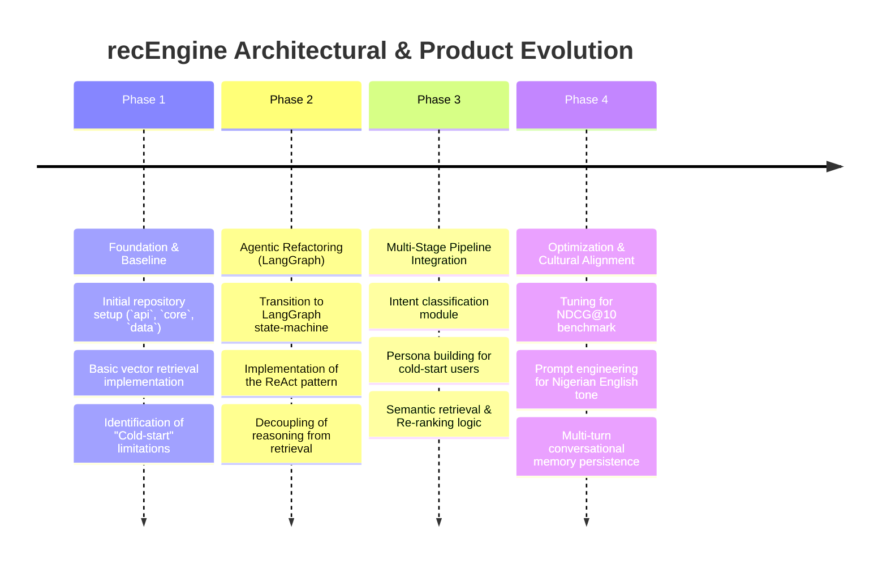
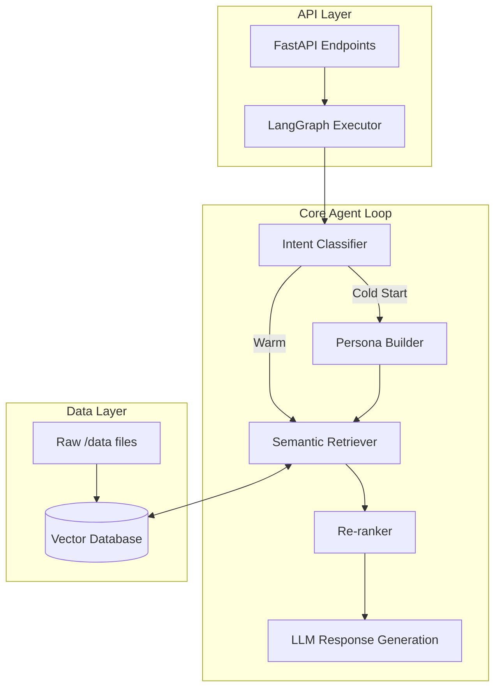

# recEngine (heygent): Project History, Architectural Evolution & Analysis
**Document Status**: Archival & Onboarding Reference  
**Project North Star**: A highly contextual, LangGraph-based recommendation agent designed to overcome "cold-start" issues while maintaining a culturally resonant tone (Nigerian English). Built for the BCT Hackathon.

---

## 1. Executive Summary & Project Genesis
The `recEngine` (codenamed `heygent`) project originated as a "Task B" recommendation engine for the BCT Hackathon. The primary challenge was moving beyond simple, rigid API wrappers to a truly agentic architecture capable of nuanced reasoning.

Initial iterations relied on static retrieval, which struggled with the "cold-start" problem (recommending items to new users with no history) and failed to meet the required NDCG@10 metric benchmarks. Through a significant architectural refactor, the system was upgraded to utilize a LangGraph-based ReAct (Reasoning and Acting) loop, integrating multi-stage persona building, intent classification, and semantic retrieval.

This document details the transition from a procedural API script to a state-driven, multi-stage agentic workflow.

---

## 2. Chronological Project Timeline

### Phase 1: Foundation & Baseline
* **Initial State**: The codebase consisted of straightforward scripts designed to pull recommendations based on hardcoded user profiles. It functioned as a thin wrapper around a Large Language Model and a basic vector store.
* **Action Taken**: Benchmarking revealed poor performance on cold-start queries. The project was reorganized into clear `api`, `core`, and `data` directories to prepare for a more complex, modular agent architecture.

### Phase 2: Agentic Refactoring (LangGraph)
* **Initial State**: Logic was procedural, making multi-turn conversation and iterative reasoning (e.g., searching, evaluating, re-searching) impossible.
* **Action Taken**: Completely refactored the core engine to use **LangGraph**. Implemented the ReAct (Reasoning and Acting) pattern. This allowed the agent to pause, analyze intermediate search results, and refine its queries before formulating a final response to the user.

### Phase 3: Multi-Stage Pipeline Integration
* **Initial State**: Retrieval was one-dimensional, often pulling irrelevant context if the user's initial query was vague.
* **Action Taken**: Introduced a multi-stage pipeline:
  1. **Intent Classification**: Determine exactly what the user is seeking.
  2. **Persona Building**: For cold-start users, the system infers a temporary persona based on conversational cues to guide initial recommendations.
  3. **Semantic Retrieval**: Fetch candidates from the data layer.
  4. **Re-ranking**: Score and re-order candidates to optimize the NDCG@10 metric.

### Phase 4: Optimization & Cultural Alignment
* **Initial State**: Responses were generic and lacked localized flavor.
* **Action Taken**: Refined the system prompts and agent persona to ensure responses maintain a culturally appropriate tone (Nigerian English) without sacrificing the accuracy of the recommendations. Handled multi-turn context windowing to ensure memory persists across user sessions.

---

## 3. Deep-Dive: Key Problems & Architectural Solutions

### 3.1 The "Cold-Start" Problem
#### The Problem
Standard recommendation systems require historical user data to generate accurate matches. In a hackathon context, testing with new user profiles resulted in generic, low-quality recommendations that failed to meet the NDCG@10 threshold.

#### The Solution
Implemented a **Persona Building** module within the LangGraph workflow. When user history is null, the agent triggers a specific conversational sub-graph designed to ask culturally relevant, low-friction profiling questions. These inputs are dynamically mapped to a synthetic persona, which acts as the seed for the first semantic retrieval pass.

### 3.2 Escaping the "Thin Wrapper" Trap
#### The Problem
Early code executed a single LLM call with search results injected into the prompt. If the search results were poor, the LLM had no mechanism to recover, resulting in hallucinations or "I don't know" responses.

#### The Solution
Integrated the **ReAct Pattern**. The agent now operates in a loop:
1. **Thought**: What information do I need?
2. **Action**: Query the vector store.
3. **Observation**: Evaluate the returned data. If insufficient, re-query with different parameters.
4. **Final Answer**: Synthesize the validated data into a localized response.

---

## 4. Architectural Ledger & Subsystem Design

### 4.1 `api` Module
* Houses the FastAPI application serving the agent endpoints. Handles incoming chat requests and formats SSE (Server-Sent Events) for streaming responses to the frontend.

### 4.2 `core` Module
* Contains the LangGraph state definitions, node functions (Reason, Retrieve, Rerank, Respond), and the LLM orchestration logic. 
* System prompts designed for Nigerian English nuances are stored here.

### 4.3 `data` Module
* Scripts and utilities for embedding generation, vector store ingestion, and managing mock user profiles for benchmark testing.

---

## 5. Future Regression Prevention Guide

### 1. LangGraph State Immutability
* **Do not mutate state directly within nodes**. LangGraph relies on functional updates to the state dictionary. Always return a dictionary with the updated keys (e.g., `return {"messages": [new_message]}`) rather than modifying the existing list in place, which breaks the graph's history and rollback capabilities.

### 2. Prompt Drift
* **Maintain Cultural Prompting Bounds**: The Nigerian English persona is carefully balanced to be conversational but professional. When tweaking prompts to improve extraction, ensure you run regression tests against baseline conversational inputs to prevent the LLM from drifting into overly formal or inappropriate dialects.

### 3. NDCG@10 Benchmarking
* **Test before merging retrieval changes**: Any modification to the embedding model or the re-ranking weighting logic must be run against the `data` benchmark suite. Ensure the NDCG@10 metric does not regress below the hackathon target before deploying.

---
*recEngine (heygent) Architecture & History Ledger · Compiled for Archival · 2026*
