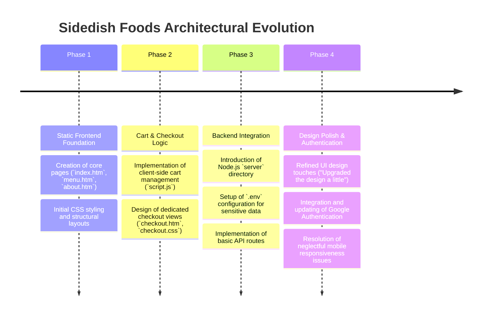
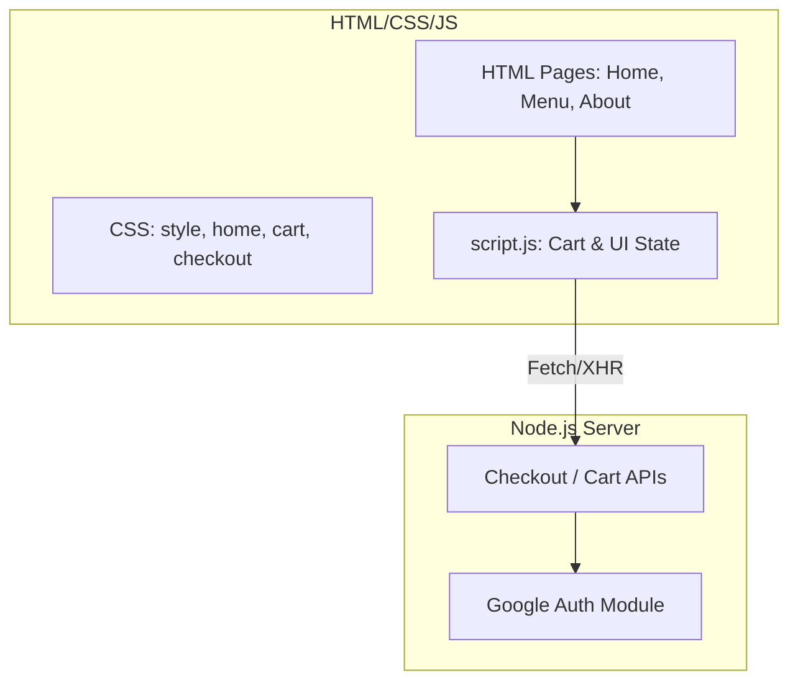

# Sidedish Foods: Project History, Architectural Evolution & Analysis
**Document Status**: Archival & Onboarding Reference  
**Project North Star**: A responsive e-commerce food ordering platform focusing on a seamless cart-to-checkout pipeline and integrated Google authentication.

---

## 1. Executive Summary & Project Genesis
`Sidedish Foods` was developed as a comprehensive web application to handle online food ordering. The project spans both frontend and backend responsibilities, emphasizing a fluid user experience from menu browsing to final checkout.

Early versions focused heavily on establishing the core HTML/CSS structures (`home.htm`, `menu.htm`, `cart.css`) and basic JavaScript interactivity. As the project matured, it integrated a Node.js/Express server to handle backend routing and authentication. The project went through several design iterations to improve mobile responsiveness and streamline the Google Auth flow.

This document traces the development from static frontend pages to an integrated, responsive e-commerce web application.

---

## 2. Chronological Project Timeline

### Phase 1: Static Frontend Foundation
* **Initial State**: The project started as a collection of static HTML files.
* **Action Taken**: Developed the core user flows. Established the visual hierarchy in `style.css` and `home.css`.

### Phase 2: Cart & Checkout Logic
* **Initial State**: Users could view items but lacked a mechanism to stage orders.
* **Action Taken**: Built the shopping cart logic entirely in vanilla JavaScript (`script.js`). Created dedicated styling and layout for the checkout process to minimize friction during the final purchase step.

### Phase 3: Backend Integration
* **Initial State**: The application was purely client-side, unable to process real transactions or securely authenticate users.
* **Action Taken**: Initialized a Node.js backend (`server` folder). Set up package management (`package.json`) and environment variables (`.env`) to securely handle API keys and server configurations.

### Phase 4: Design Polish & Authentication
* **Initial State**: The application looked functional on desktop but suffered on mobile screens. Authentication flows were either missing or outdated.
* **Action Taken**: Addressed "neglectful mobile responsiveness issues," ensuring the menu and cart are easily accessible on smaller devices. Updated the Google Auth implementation to adhere to modern OAuth 2.0 standards, providing users with a secure, one-click login experience.

---

## 3. Deep-Dive: Key Problems & Architectural Solutions

### 3.1 Mobile Responsiveness
#### The Problem
The initial design prioritized desktop views. When viewed on mobile, the cart interface and navigation menu overlapped, creating a frustrating user experience.

#### The Solution
Implemented comprehensive CSS media queries. Refactored the navigation bar to collapse into a hamburger menu on smaller screens, and adjusted the grid layouts on the menu page to flow vertically rather than horizontally.

### 3.2 Client-Side State Management
#### The Problem
Without a complex frontend framework like React, managing the cart state (items, quantities, total price) across different HTML pages (Menu -> Cart -> Checkout) was difficult.

#### The Solution
Utilized `localStorage` within `script.js` to persist the cart data. Whenever an item is added, the script updates the local cache, allowing the user to navigate between `menu.htm` and `checkout.htm` without losing their selected items.

### 3.3 Authentication Modernization
#### The Problem
Legacy authentication methods posed security risks and added friction to the checkout process.

#### The Solution
Integrated Google Authentication via the backend server. The updated flow securely exchanges tokens, preventing sensitive data from being exposed on the client side, and instantly populates the user's details during checkout.

---

## 4. Architectural Ledger & Subsystem Design

### 4.1 Frontend Architecture
* **Vanilla Stack**: Relies on standard web technologies without the overhead of heavy frameworks, ensuring fast load times.
* **Modular CSS**: Separation of concerns achieved by splitting styles into `home.css`, `cart.css`, and `checkout.css`.

### 4.2 Backend Architecture
* **Node.js**: Handles API requests, authentication handshakes, and serves dynamic content if necessary. 
* **Security**: Utilizes `.env` to keep secrets out of the Git repository.

---

## 5. Future Regression Prevention Guide

### 1. State Persistence
* Ensure that any modifications to the cart object structure in `script.js` include backward compatibility checks. If the data structure changes, existing users with old data in `localStorage` may experience application crashes during the checkout phase.

### 2. Environment Variables
* The `.env` file must never be committed. Ensure `.gitignore` remains intact. The server will fail to start if the Google Auth credentials or database connection strings are missing.

### 3. CSS Specificity
* Because CSS is modularized but loaded globally across some pages, be wary of class name collisions between `cart.css` and `checkout.css`. Stick to a consistent naming convention (like BEM) for any new UI components.

---
*Sidedish Foods Architecture & History Ledger · Compiled for Archival · 2026*
