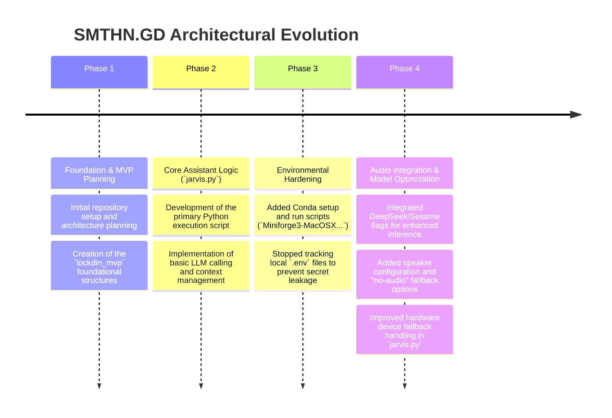
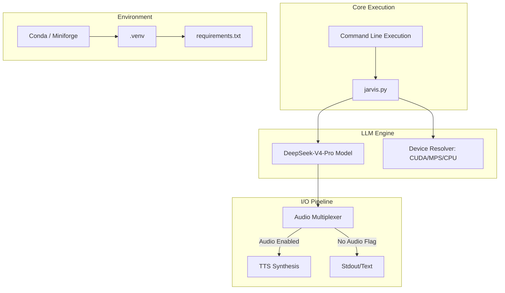

# SMTHN.GD (Jarvis / Lockdin MVP): Project History & Analysis
**Document Status**: Archival & Onboarding Reference  
**Project North Star**: An experimental, Python-based AI assistant ecosystem integrating local LLMs (DeepSeek) and audio generation for a highly responsive, conversational interface.

---

## 1. Executive Summary & Project Genesis
The `SMTHN.GD` repository houses an ambitious AI automation prototype, primarily focusing on building an intelligent voice-interactive assistant (often referred to internally as "Jarvis") and an MVP platform labeled `lockdin_mvp`.

The project diverged from standard API wrapper applications by attempting to run heavy inference locally. It utilizes sophisticated Python scripting (`jarvis.py`), Conda environment management for dependency isolation, and integrates with the DeepSeek-V4-Pro model for advanced reasoning capabilities. The development journey reflects a heavy focus on device handling (GPU/CPU fallbacks), audio I/O pipeline creation, and environmental configuration.

This document captures the structural evolution of the SMTHN.GD prototype, focusing on its pivot towards local AI inference and complex environment management.

---

## 2. Chronological Project Timeline

### Phase 1: Foundation & MVP Planning
* **Initial State**: The project started as a conceptual MVP (`lockdin_mvp`), aiming to build a specialized AI tool.
* **Action Taken**: Established the base directory structure, defining the scope through initial markdown plans (`plan.md`).

### Phase 2: Core Assistant Logic
* **Initial State**: Required a central execution engine to handle user inputs and AI responses.
* **Action Taken**: Developed `jarvis.py`, the core orchestration script. This script was designed to manage the conversational loop, tying together the user's prompt, the context window, and the LLM execution.

### Phase 3: Environmental Hardening
* **Initial State**: Managing Python dependencies across different hardware (especially for AI libraries like PyTorch) caused significant friction. Secrets were occasionally at risk of being committed.
* **Action Taken**: Overhauled the environment management. Introduced Conda setup scripts to ensure deterministic installations across different machines (specifically catering to local execution). Explicitly removed `.env` tracking to secure API keys.

### Phase 4: Audio Integration & Model Optimization
* **Initial State**: The assistant was purely text-based and occasionally crashed if specialized AI hardware (GPUs) was unavailable.
* **Action Taken**: Integrated advanced flags to prefer `DeepSeek` models. Built an audio I/O pipeline allowing the assistant to speak, complete with command-line flags for a `no-audio` headless mode. Most importantly, implemented robust `try/except` fallback logic in `jarvis.py` to seamlessly drop down to CPU execution if CUDA/MPS hardware accelerators were missing.

---

## 3. Deep-Dive: Key Problems & Architectural Solutions

### 3.1 Hardware Device Fallbacks
#### The Problem
Running local AI models requires hardware acceleration. If a script hardcodes `device='cuda'`, it will instantly crash on a standard MacBook or a Windows machine without an Nvidia GPU, making cross-platform development impossible.

#### The Solution
Implemented dynamic device resolution in `jarvis.py`. The script probes the system architecture at runtime using `torch.backends`:
1. Attempts CUDA (Nvidia).
2. Falls back to MPS (Apple Silicon).
3. Defaults to CPU (Slow but universally compatible).
This ensured the assistant could run anywhere, albeit at different speeds.

### 3.2 Audio State Management
#### The Problem
In headless server environments or during rapid iterative testing, initializing audio drivers (for text-to-speech) causes delays or outright failures if no output device is detected.

#### The Solution
Added a strict `no-audio` flag to the application. When executed with this flag, the orchestration script entirely bypasses the audio synthesis pipeline, returning plain text instantly. This decoupled the reasoning engine from the presentation layer.

---

## 4. Architectural Ledger & Subsystem Design

### 4.1 System Components
* **Orchestrator**: `jarvis.py` acts as the main entry point, handling argument parsing and subsystem initialization.
* **Environment**: Strictly managed via Conda (`Miniforge3`) to handle complex binary dependencies that `pip` struggles with.
* **Submodules**: Includes `csm` and potentially other git submodules (`.gitmodules` present) linking to external AI utilities.

---

## 5. Future Regression Prevention Guide

### 1. Dependency Management
* **Strictly use Conda for ML packages**: When adding new machine learning libraries, prefer `conda install` over `pip install` whenever possible to prevent C++ compiler conflicts, especially for libraries relying on hardware acceleration. Always update `requirements.txt` / `environment.yml` synchronously.

### 2. Audio Driver Dependencies
* **Testing Headless**: If deploying this to a cloud environment (like an AWS EC2 instance), always ensure the `no-audio` flag is passed. Cloud instances lack virtual audio drivers, and attempting to initialize the TTS engine will cause fatal system exit errors.

### 3. Git Submodule Maintenance
* **Submodule Initialization**: Because the repository relies on `.gitmodules`, developers cloning the project fresh must run `git submodule update --init --recursive`. Failure to do so will result in missing directories (like `csm`) and immediate `ModuleNotFoundError` exceptions upon running `jarvis.py`.

---
*SMTHN.GD (Jarvis) Architecture Ledger · Compiled for Archival · 2026*
