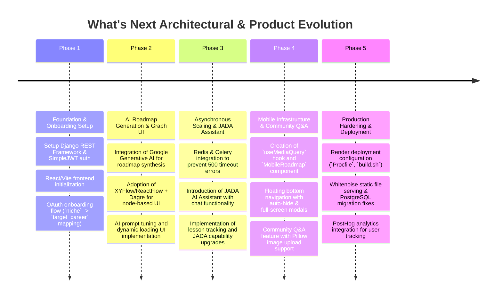
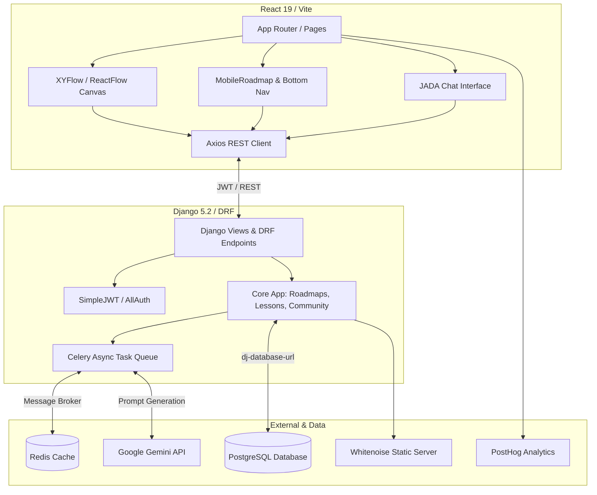

# What's Next: Project History, Architectural Evolution & Analysis
**Document Status**: Archival & Onboarding Reference  
**Project North Star**: A comprehensive, AI-powered career roadmap generation and continuous learning platform ("Infinite Dev Loop"). Built with Django and React to deliver dynamic, node-based interactive roadmaps, personalized lesson tracking via the JADA AI assistant, and vibrant community interaction.

---

## 1. Executive Summary & Project Genesis
`What's Next` began as a specialized tool to solve the career progression dilemma for aspiring and junior developers. The foundational premise relied on leveraging Large Language Models to generate tailored, interactive career roadmaps based on user onboarding preferences (target career, current skill level, and learning style).

Early iterations established the core Django REST Framework backend and a React frontend. However, as the feature set expanded to include AI roadmap generation, community Q&A, and interactive chat assistant capabilities (JADA), the project encountered significant challenges. These included LLM timeout errors, CORS/deployment friction on Render, complex state management for interactive flowcharts, and mobile layout breaking.

Through a series of dedicated hardening sprints, the project evolved into a robust, production-ready full-stack application. Key modernization efforts included Celery/Redis asynchronous task offloading, XYFlow/Dagre graph visualization, a dedicated mobile infrastructure, and automated deployment pipelines.

This document serves as the authoritative historical ledger detailing every architectural pivot, challenge, and optimization made during the development of `What's Next`.

---

## 2. Chronological Project Timeline

### Phase 1: Foundation & Onboarding Setup
* **Initial State**: The repository began as separate backend and frontend boilerplate structures. Initial user models lacked the depth required for personalized AI generation.
* **Action Taken**: Configured Django REST Framework with `djangorestframework-simplejwt` for secure, token-based authentication. Developed a comprehensive OAuth onboarding flow designed to capture user requirements. Addressed early data model misalignments, such as refactoring onboarding fields (`niche` to `target_career`) to ensure clean data handoffs to the AI engine.

### Phase 2: AI Roadmap Generation & Graph UI
* **Initial State**: Generating career roadmaps synchronously caused severe bottlenecks. Early visual representations were static and failed to convey complex prerequisite relationships.
* **Action Taken**: Integrated `google-generativeai` to synthesize structured JSON roadmaps. To visualize these structures, the frontend adopted `@xyflow/react` (ReactFlow) combined with `dagre` for automated hierarchical layout calculation. Added dynamic loading UIs to keep users engaged during the AI generation phase.

### Phase 3: Asynchronous Scaling & JADA Assistant
* **Initial State**: Heavy LLM calls frequently exceeded server timeout limits (causing persistent `500 Server Error` crashes). Furthermore, users lacked guidance once a roadmap was generated.
* **Action Taken**: 
  * **Asynchronous Offloading**: Integrated Celery backed by Redis (`redis==5.0.1`). Heavy roadmap generation and resource fetching tasks were moved to background workers, instantly resolving server timeout issues.
  * **JADA AI Assistant**: Introduced JADA, a persistent conversational assistant embedded within the platform. Added lesson tracking capabilities, allowing JADA to quiz users, recommend specific learning resources, and track progress along their active roadmap nodes.

### Phase 4: Mobile Infrastructure & Community Q&A
* **Initial State**: The node-based XYFlow canvas was virtually unusable on mobile viewports. Canvas dragging conflicted with native mobile scrolling, and complex node details bled off-screen.
* **Action Taken**: Engineered a dedicated mobile presentation layer.
  * **Mobile Roadmap**: Created the `useMediaQuery` hook to dynamically render a streamlined `MobileRoadmap` component on smaller screens, replacing the complex 2D canvas with an elegant, vertical expandable timeline.
  * **Navigation & Modals**: Implemented a floating bottom navigation bar with auto-hide behavior and full-screen module modals to ensure 100% legibility on mobile devices.
  * **Community Q&A**: Built out the community discussion forum, integrating `Pillow` on the backend to support secure image uploads for user questions and project showcases.

### Phase 5: Production Hardening & Deployment
* **Initial State**: Deploying a decoupled Django/React app to Render presented CORS errors, database connection string mismatches, and static file serving failures.
* **Action Taken**: Standardized the deployment architecture using `gunicorn` and `dj-database-url`. Configured `Whitenoise` to serve static files directly from the Django application. Created a robust `Procfile` and `build.sh` script to automatically execute database migrations (`manage.py migrate`) and bundle the React frontend during the Render build phase. Finally, integrated `posthog` across both frontend and backend for advanced telemetry and user journey tracking.

---

## 3. Deep-Dive: Key Problems & Architectural Solutions

### 3.1 The LLM Timeout & 500 Server Error Crisis
#### The Problem
During early testing, requesting a complete 12-month career roadmap from the Gemini API took upwards of 15–20 seconds. Because Django processed these requests synchronously within the main HTTP request-response cycle, cloud load balancers (like Render's proxy) would terminate the connection after 10 seconds, throwing a fatal `500 Internal Server Error`.

#### The Solution
Decoupled the request lifecycle using **Celery and Redis**.
1. **Initiation**: When a user submits their onboarding preferences, Django immediately spawns an asynchronous Celery task (`generate_roadmap_task.delay(user_id)`) and returns a `202 Accepted` status with a `task_id`.
2. **Polling / SSE**: The React frontend transitions to a dynamic loading screen, polling a lightweight task status endpoint (or listening via WebSockets/SSE) to check task progress.
3. **Completion**: Once the Celery worker completes the LLM synthesis and persists the nodes to PostgreSQL, the frontend fetches the completed roadmap payload, ensuring a buttery-smooth user experience without server drops.

### 3.2 Mobile Canvas Scroll Conflicts
#### The Problem
ReactFlow/XYFlow captures touch events for canvas panning and zooming. On mobile devices, when users attempted to scroll down the dashboard, touching the roadmap canvas trapped their scroll, preventing them from reaching the bottom of the page or navigating the app.

#### The Solution
Implemented a dual-pronged mobile strategy:
* **Conditional Rendering**: Used `window.matchMedia` / `useMediaQuery` to detect mobile viewports (`<768px`). On mobile, the interactive 2D XYFlow canvas is completely unmounted.
* **Mobile Roadmap Component**: Replaced the canvas with `MobileRoadmap.jsx`, an expandable vertical tree layout built with Framer Motion. This eliminated touch-trapping entirely, allowing native vertical scrolling while preserving the hierarchical presentation of the roadmap.

### 3.3 Cross-Origin & Deployment Mismatches
#### The Problem
Moving from local development (`localhost:8000` / `localhost:5173`) to production on Render caused severe CORS failures and broken API routing, as the frontend attempted to fetch from hardcoded local URLs.

#### The Solution
Centralized API configuration in the React frontend (`api.js` / `axios` instance) utilizing Vite environment variables (`import.meta.env.VITE_API_BASE_URL`). On the Django backend, `django-cors-headers` was configured to dynamically whitelist the production frontend URL while allowing credentials for secure SimpleJWT cookie/header transmission.

---

## 4. Architectural Ledger & Subsystem Design

### 4.1 Frontend Architecture (`frontend`)
* **Framework**: React 19 bundled via Vite (`@vitejs/plugin-react-swc`).
* **Graph Engine**: `@xyflow/react` powered by `dagre` for automatic layout calculation.
* **Animation & 3D**: `framer-motion` for mobile modals/transitions; `three.js` for landing page visual accents.
* **Styling**: Tailwind CSS combined with `lucide-react` icons.

### 4.2 Backend Architecture (`whats_next_backend` & `core`)
* **Core Application**: Django 5.2 serving RESTful endpoints via Django REST Framework.
* **Async Processing**: Celery workers backed by Redis 5.0 handling LLM interactions and heavy RSS/resource fetching (`feedparser`).
* **Database**: PostgreSQL managed via `psycopg2-binary` and `dj-database-url` for seamless environment variable injection.
* **Media & Static**: `Pillow` for image validation; `Whitenoise` for production static asset serving behind Gunicorn.

---

## 5. Future Regression Prevention Guide

### 1. Asynchronous Task Queue Guardrails
* **Always run Celery locally when testing roadmap generation**. Because roadmap synthesis is offloaded to `generate_roadmap_task`, clicking "Generate Roadmap" in local development without a running Celery worker (`celery -A whats_next_backend worker -l INFO`) and a running Redis server will result in the frontend hanging indefinitely on the loading screen.

### 2. Environment Variable Integrity
* **Preserve `dj-database-url` Configuration**: The Django `settings.py` relies on `dj_database_url.config()`. Never replace `DATABASES` with hardcoded SQLite/PostgreSQL dictionaries, as this will immediately break Render deployments and cloud database connection pooling.

### 3. XYFlow / ReactFlow Dependency
* **Lock XYFlow Versions**: The graph visualization relies on specific `@xyflow/react` node and edge props. Upgrading XYFlow without verifying custom node components (`CustomNode.jsx`) can cause silent rendering failures where the canvas appears entirely blank.

### 4. Mobile Breakpoint Discipline
* **Do not reintroduce 2D Canvas elements to mobile viewports**. Any new interactive charting or graphing features must adhere to the `useMediaQuery` pattern established in `MobileRoadmap.jsx`. Forcing 2D canvas navigation on mobile will regress the app's touch-scrolling stability.

---
*What's Next Architecture & History Ledger · Compiled for Archival · 2026*
